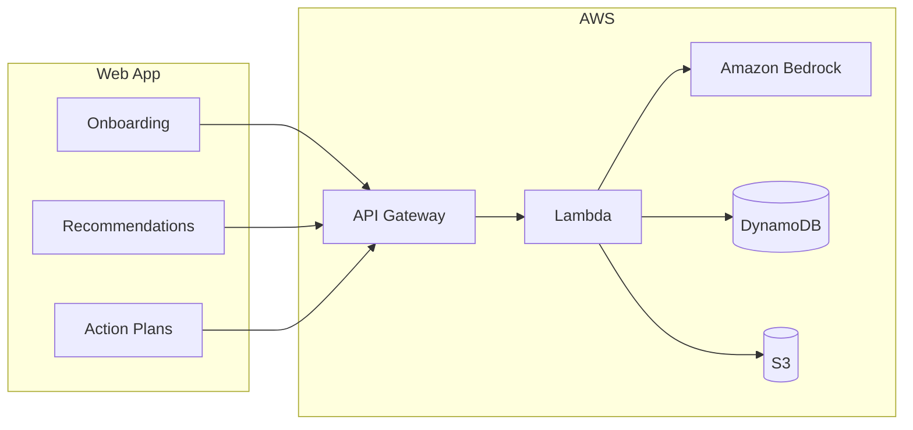

# EduPath

**AI-powered K–12 to college planning assistant** — built for the AWS Hackathon 2025 (**Cloud for Good** track).

> Give every student, especially first-generation learners, the same quality of academic guidance that wealthy families pay thousands of dollars for.

---

## Why We Built This

College and career planning in the U.S. often depends on who you know — not what you know. Students from well-resourced families get private counselors, summer program lists, and step-by-step application playbooks. Many others navigate alone.

We built **EduPath** for students who do not have that safety net:

- **First-generation students** whose parents may not have attended college in the U.S. and cannot explain FAFSA, research programs, or how to build a competitive profile.
- **Students with busy or working parents** who want to help but lack time to research every opportunity, deadline, and requirement.
- **Anyone without access to a school counselor** who can dedicate hours to one-on-one planning.

EduPath acts as a patient, always-available academic advisor: it learns who you are, suggests realistic paths matched to your grade and interests, and turns your chosen path into a concrete plan with steps, materials, deadlines, and resources — all grounded in *your* profile, not generic advice.

---

## Team

| Name | |
|------|---|
| Zeen Zheng | |
| Haoqian Li | |
| Robin Ding | |
| Anderson Niu | |

**Hackathon track:** Cloud for Good

---

## How It Works



1. **Onboard** — Grade, interests, extracurriculars, and goals are saved to a persistent student profile.
2. **Get recommendations** — Bedrock generates personalized tracks (research, internships, competitions, college prep, etc.) with difficulty scores tied to the student’s background.
3. **Select a track** — The student picks one path; the choice is stored for planning and recalibration.
4. **Generate a plan** — Step-by-step action guide with materials, deadlines, milestones, prerequisites, and (for grades 11–12) a college fit chart.
5. **Return over time** — Conversation history and past plans inform the next round of recommendations when a track is completed or changed.

The app is split into two coordinated backends that share the same DynamoDB profile:

| System | Responsibility |
|--------|----------------|
| **Recommendation** | Profile CRUD, AI track recommendations, track selection, difficulty recalibration after outcomes |
| **Planning** | Action plan generation, S3 storage for plans/charts, outcome recording to feed back into recommendations |

---

## What We Built

**Recommendation system**
- Reads the student profile from DynamoDB and calls Amazon Bedrock for grade-appropriate track suggestions.
- Every recommendation references specific profile details (interests, grade, goals, extracurriculars).
- Tracks include difficulty scores derived from their tasks; recalibration runs when a track is completed or aborted.

**Planning system**
- After track selection, generates a structured action plan: steps, required materials, deadlines, weekly milestones, resources, and prerequisites.
- Grade 11–12 students also receive a **college fit chart** (reach / match / safety schools).
- Plans and charts can be persisted to **S3**; progress and outcomes flow back to DynamoDB.

**Product features**
- Student onboarding (interest picker, grade, goals)
- Personalized AI track recommendations
- Action guides with expandable step detail
- Recommendations and Plans tabs with session memory across visits
- **AWS Amplify** hosting and **Amazon Cognito** auth (production); local demo with mock AI and `localStorage`

---

## AWS Architecture

### Services

| Service | Role |
|---------|------|
| **Amazon Bedrock** | Core AI (Claude Sonnet) for recommendations and plan generation |
| **AWS Lambda** | Serverless API logic — Python 3.12, zip deployments |
| **Amazon API Gateway** | HTTP entry point from the React frontend |
| **Amazon DynamoDB** | Student profiles, selected tracks, conversation context |
| **Amazon S3** | Generated application plans and college fit charts |
| **AWS Amplify** | Frontend hosting, CI/CD, Cognito integration |
| **Amazon Cognito** | User authentication; sessions tied to persistent profiles |
| **Amazon CloudWatch** | Logs and monitoring for Lambdas and API Gateway |
| **AWS IAM** | Least-privilege roles for Lambda, Bedrock, DynamoDB, and S3 |

### Lambda functions

All functions use the `edupath-*` naming convention and are wired through API Gateway:

| Function | Purpose |
|----------|---------|
| `edupath-create-profile` | `POST /profile` — save onboarding data |
| `edupath-get-profile` | `GET /profile` — load student profile |
| `edupath-recommend` | `POST /recommend` — generate track recommendations (System 1) |
| `edupath-select-track` | `POST /select-track` — persist the student’s chosen track |
| `edupath-generate-plan` | `POST /plan` — build action guide and optional college fit chart (System 2) |
| `edupath-record-outcome` | `POST /outcome` — record application results; triggers recalibration |

---

## Project Structure

```
AWSHackathon/
├── frontend/                 # React + Vite + TypeScript (Amplify)
│   └── src/
│       ├── pages/            # Main app UI
│       └── services/         # api.ts (live API) + mockAi.ts (local demo)
├── recommendation/           # System 1
│   ├── lambdas/
│   │   ├── create_profile/
│   │   ├── get_profile/
│   │   ├── recommend/
│   │   └── select_track/
│   ├── db/
│   ├── prompts/
│   └── bedrock_utils.py
└── planning/                 # System 2
    ├── lambdas/
    │   ├── generate_plan/
    │   └── record_outcome/
    ├── db/
    ├── prompts/
    ├── s3_utils.py
    └── bedrock_utils.py
```

---

## Tech Stack

| Layer | Technologies |
|-------|----------------|
| Frontend | React 19, TypeScript, Vite, Tailwind CSS, Radix UI |
| Backend | Python 3.12 on AWS Lambda |
| AI | Amazon Bedrock (Anthropic Claude Sonnet 4.5) |
| Data | DynamoDB, S3 |
| Auth & deploy | Amazon Cognito, AWS Amplify |

---

## Out of Scope (Hackathon Cuts)

- Amazon Textract document parsing  
- Amazon Comprehend analysis  
- AWS Step Functions orchestration pipeline  
- Amazon SES email delivery  
- Mobile-responsive layout polish  
- Multi-student / parent dashboard  
- Interactive progress tracker (planned for v2)

---

## Getting Started

### Frontend — local demo (no AWS required)

The UI runs standalone with **mock AI** (simulated Bedrock responses) and **`localStorage`** persistence.

```bash
cd frontend
npm install
npm run dev
```

Open the URL Vite prints (typically `http://localhost:5173`).

**Demo profile:** sign in with any email containing `maria` (e.g. `maria@demo.com`) to load pre-built sample data.

### Frontend — connected to AWS

1. Deploy Lambdas and API Gateway routes (see table above).
2. Enable **Bedrock model access** for Claude Sonnet in your AWS account (`us-east-1`).
3. Create a `.env` in `frontend/`:

```env
VITE_API_BASE_URL=https://your-api-id.execute-api.us-east-1.amazonaws.com/prod
```

4. Run `npm run dev` or deploy via **Amplify**.

### Backend — local testing

Each subsystem includes local test scripts that mock DynamoDB/S3 where needed:

```bash
cd recommendation
python test_local.py

cd ../planning
python test_local.py
```

Production Lambdas, DynamoDB tables, S3 buckets, Cognito user pools, and IAM roles are configured in the **AWS Console** (or your team’s IaC, if added later).

---

## Pre-existing Code or Templates

None. All application code was written during the hackathon.

---

## License

See repository license file if present; otherwise contact the team for usage terms.
